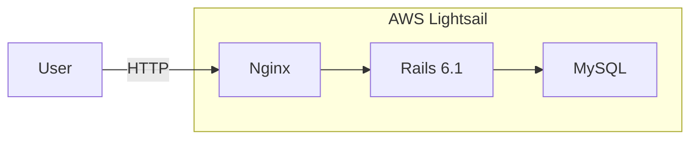
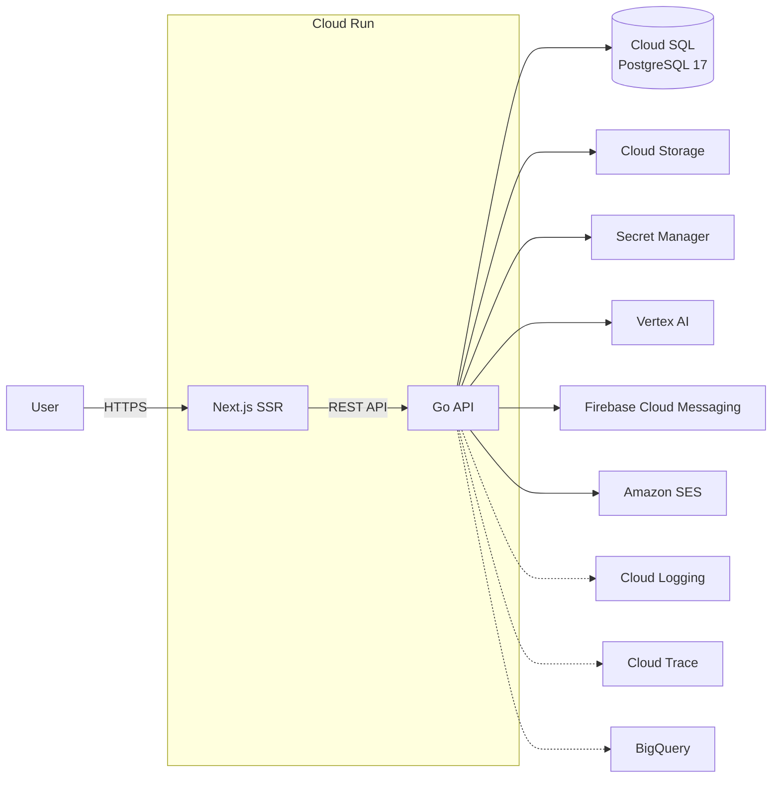
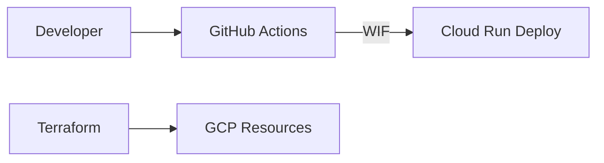

## 案件名
小説・朗読投稿サービス リアーキテクチャ（個人開発）

## 期間
2026年3月 ～ 2026年4月（2026年4月カットオーバー済み・運用中）

## 体制
2名（開発・インフラ：自身1名、運営：1名）

## 役割
アーキテクチャ設計 / バックエンド開発 / フロントエンド開発 / モバイルアプリ開発 / インフラ構築 / Agentic Engineering の設計・運用

## 背景
3年間 Ruby on Rails + AWS Lightsail で運用してきた個人サービスに対し、フルリアーキテクチャを実施。

AIエージェントが実用レベルに達したのではないかという仮説を、実サービスのフルリアーキテクチャで検証するために開始。エージェントが安全に動作するためのハーネス（lint / test / security scan の自動ゲート）を設計・構築し、品質を担保しながら移行を推進した。業務で蓄積した Go / Google Cloud の知見を深化させる狙いもあった。

## 技術スタック

### 移行後
- Go（Gin / GORM）
- TypeScript / Next.js 16（App Router / SSR / Tailwind CSS / PWA）
- Google Cloud（Cloud Run / Cloud SQL PostgreSQL 17 / Cloud Storage / Secret Manager / Cloud Logging / Cloud Trace / BigQuery / Vertex AI）
- Terraform（全インフラをIaC管理）
- GitHub Actions（CI/CD + Workload Identity Federation）
- OpenTelemetry（分散トレーシング）
- Firebase Cloud Messaging（プッシュ通知）
- Stripe（決済）
- Amazon SES（メール配信）
- Swift（SwiftUI）/ Kotlin（Jetpack Compose）によるネイティブモバイルアプリ（TestFlight でベータ検証中）

### 移行前
- Ruby on Rails 6.1
- AWS Lightsail
- MySQL
- Nginx

## アーキテクチャ

### Before

### After（ランタイム）

### After（CI/CD・IaC）

## 技術的なポイント

### Agentic Engineering × ハーネスエンジニアリング
- AIエージェントが安全にコードを生成・修正できるハーネス（AIエージェント向けの品質担保基盤。lint / test / security scan の自動ゲート）を構築
- Playwright E2E（API mock + Docker結合）、Vitest、Go test -race、gosec、govulncheck、Trivy を統合した品質パイプライン
- Agentic な開発でありながら、人間が品質を担保できる仕組みを設計

### クラウドアーキテクチャ
- Cloud Run によるサーバーレス構成（min 0 でコスト最適化、オートスケール対応）
- Terraform モジュール化による dev / prod 環境の一貫管理
- Workload Identity Federation によるキーレス認証（GitHub Actions ↔ Google Cloud）
- Secret Manager による機密情報の一元管理

### バックエンド設計
- Handler → Service → Repository のレイヤードアーキテクチャ
- JWT ベースのステートレス認証（Cloud Run との親和性）
- OAuth 2.0（Google / Twitter）/ WebAuthn によるソーシャルログイン・パスワードレス認証
- OpenTelemetry による構造化ログ・分散トレーシング
- BigQuery フェデレーション による、AIエージェントがデータ分析を行うための基盤を構築
- Vertex AI によるコンテンツ自動要約・SNS投稿生成

### フロントエンド設計
- Next.js App Router によるSSR + Standalone ビルド
- PWA対応（Serwist によるオフラインサポート）
- next-intl による多言語対応

## 成果
- モノリス（Rails）からフロントエンド / バックエンド / インフラを分離し、独立デプロイ可能な構成へ移行
- 全インフラを Terraform で IaC 化し、環境の再現性と運用効率を確保
- Agentic Engineering により約1ヶ月でリアーキテクチャを完了し、ハーネスエンジニアリングの有効性を実証
- 2026年4月に本番カットオーバーを完了し、安定稼働中
